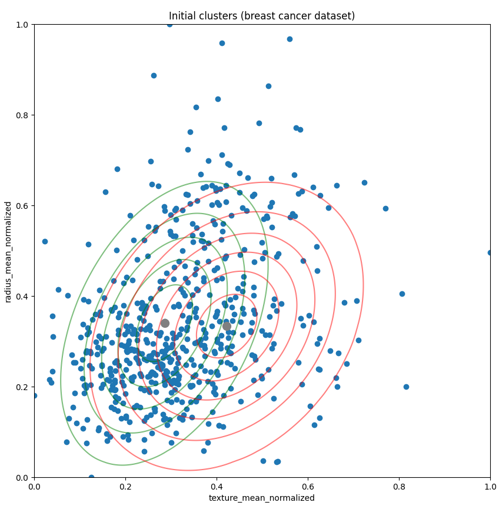
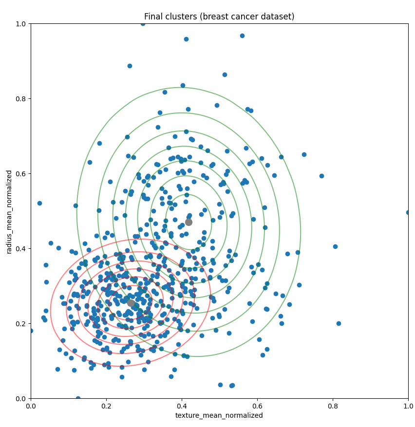
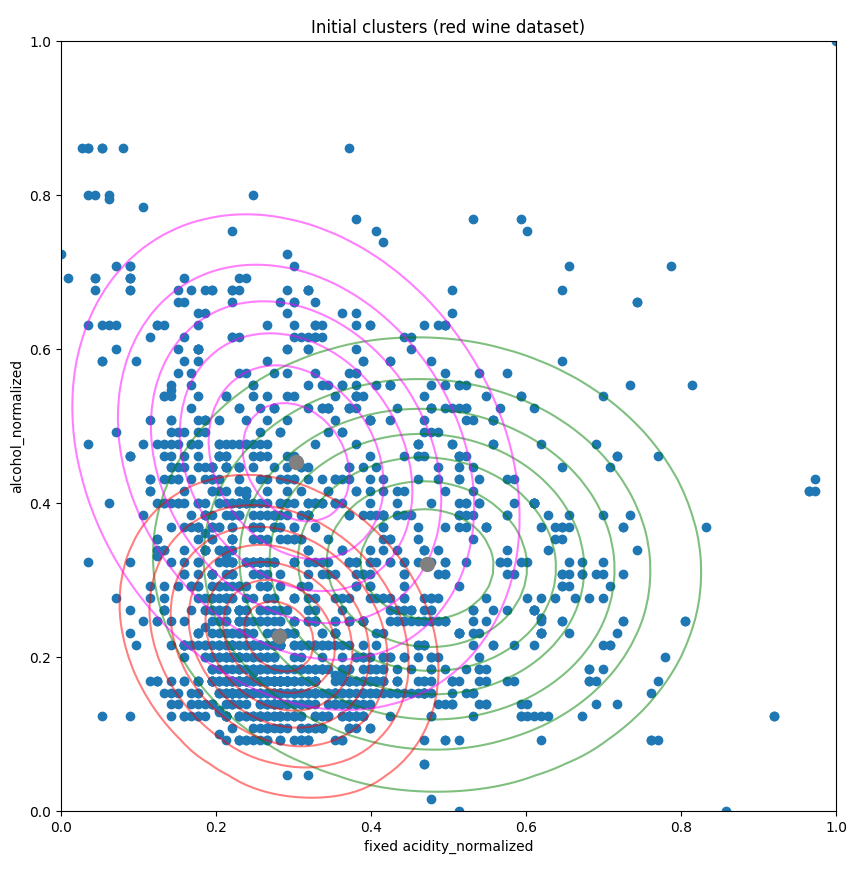
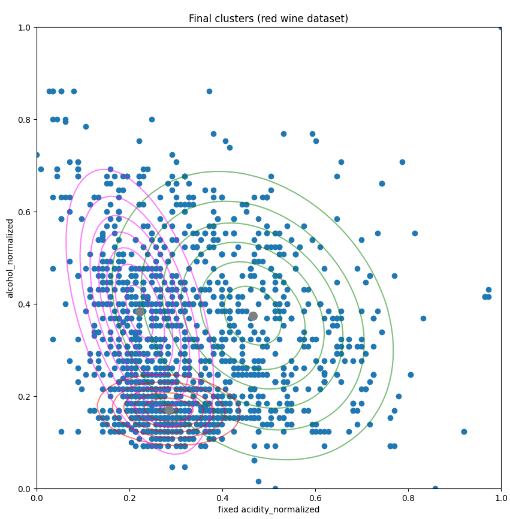

# Project 1: Some interesting data
Observing two chosen dataset from UCI ML using Gaussian Mixture Model and Histogram.

# Breast Cancer Wisconsin (Diagnostic) Dataset
Since there are two target values for a tumor: either benign or malignant, we could use GMM and EM algorithm to cluster the data into two different clusters given their features.

# Red Wine Quality Dataset
Since there are three target values for the wine quality: either low, medium, or high, we can apply GMM and EM once again to cluster the data into three different clusters given their features. The wine quality has the following values [5 6 7 4 8 3] so we can make low quality being those rated 3-4, medium quality being those rated 5-6, and high quality being those rated 7-8.

# EM Algorithm
Start with clusters where each has mean &mu;c, covariance &Sigma;c, and size &pi;c. For each sample xi, compute the probability that it belongs to cluster c, or responsibility ric.

Start with responsibility ric, update mean &mu;c, covariance &Sigma;c, and size &pi;c. For each cluster, update its parameters (total responsibility, weighted size, weighted mean, and weighted covariance) using the data points. 

The current implementation only takes into account going through a certain number of iterations, so the clusters might not be optimal.
# Compilation
Use `pip install -r requirements.txt` to install the required packages used in this project.

Then run `python main.py`.

# Plots

The example attributes chosen for breast cancer dataset are texture mean and radius mean. For red wine dataset, those are fixed acidity and alcohol.

Plotting contours for breast cancer dataset and red wine dataset after running them through the model, we have: 

### Breast Cancer Data
#### Inital clusters

#### Final clusters

### Red Wine Data
#### Inital clusters

#### Final clusters

# References

https://www.kaggle.com/uciml/breast-cancer-wisconsin-data

https://www.kaggle.com/uciml/red-wine-quality-cortez-et-al-2009

https://www.youtube.com/watch?v=qMTuMa86NzU

https://www.youtube.com/watch?v=DODphRRL79c

https://realpython.com/python-histograms/

https://stackoverflow.com/questions/21619347/creating-a-python-histogram-without-pylab

https://stackoverflow.com/questions/20011122/fitting-a-normal-distribution-to-1d-data

https://www.python-course.eu/expectation_maximization_and_gaussian_mixture_models.php

http://ethen8181.github.io/machine-learning/clustering/GMM/GMM.html#E-Step

http://www.oranlooney.com/post/ml-from-scratch-part-5-gmm/

https://machinelearningmastery.com/scale-machine-learning-data-scratch-python/

