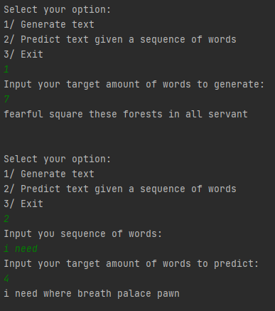

# Project 2: Hidden Markov Model
Build a Hidden Markov Model to be able to programmatically

1. Generate new text from the text corpus

2. Perform text prediction given a sequence of words

# Shakespeare play dataset

In this dataset, we are focusing on the final column (containing the line being spoken). The approach is to treat each line as a text sequence, run it through the model where tokenization is utilized. Each token is then treated as a state where we can build state transitions matrix, emissions matrix, and initial probability distribution matrix.

Each entry in the state transitions matrix represents a trasition probability from a state i to another state j (0 < i, j < number of states - 1). Each entry in the emissions matrix represents the probabilities of a state i resulting in an observed value j. Each entry in the initial probability distribution matrix represents the probability of the selected initial states.

# EM Algorithm

Start with initial transitions, emissions, and initial states' probability distribution &pi; for variable at time k0. Form the E-step where the recursive alpha function and beta function are calculated.

The alpha function is defined as the joint probability of the observed data up to time k and the state at time k, while the beta function is defined as the conditional probability of the observed data from time k+1 given the state at time k.

Then we calculate the temporary variables to help us form our M-step. &gamma; is defined as the probability of being in state i at time k given the observed sequence, while &xi; is defined as the probability of being in state i and j at times k and k+1 respectively given the observed sequence. Using these temporary variables, we can calculate the new values for transitions, emissions, and &pi;.

# Viterbi Algorithm

The Viterbi Algorithm is a prediction algorithm that makes an inference to the hidden states given that the model parameters are trained and the observed data are provided.

The algorithm starts out with initial probability of the starting states. Then, it recursively calculates the probability of set of states up to each state at the next time step and records which path would output the best set of states. The predicted sequence is then obtained based on the final path with the highest probability.

# Compilation
Use `pip install -r requirements.txt` to install the required packages used in this project.

Then run `python main.py`. The project consists of a basic user interaction where the user can select option 1 for generating new text from the existing corpus, option 2 for performing text prediction given a sequence of words, or 3 to exit the program.

This project has been trained, saved as a pickle file, and reused to perform the required tasks. Thus, the training code has been commented out.

# Results and future directions

Because of the complexity of the model and limitation of computational resources, the texts generated or predicted still have a hard time producing the most sensible sequence.

Future directions would be to test it with smaller corpus as well as different corpi to observe different behaviors. It is also ideal to train the model on a more powerful machine as well as making use of a high performance package (e.g. Numba). Also, it would be good to look into what number of hidden states is usually set as.

# References

https://medium.com/analytics-vidhya/hidden-markov-model-part-1-of-the-hmm-series-3f7fea28a08

https://medium.com/analytics-vidhya/baum-welch-algorithm-for-training-a-hidden-markov-model-part-2-of-the-hmm-series-d0e393b4fb86

https://medium.com/analytics-vidhya/viterbi-algorithm-for-prediction-with-hmm-part-3-of-the-hmm-series-6466ce2f5dc6

https://web.stanford.edu/~jurafsky/slp3/A.pdf

https://en.wikipedia.org/wiki/Baum–Welch_algorithm

https://www.youtube.com/watch?v=JRsdt05pMoI

https://en.wikipedia.org/wiki/Viterbi_algorithm

https://www.kaggle.com/kingburrito666/shakespeare-plays