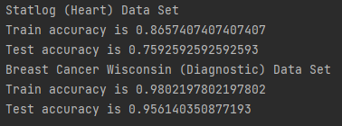
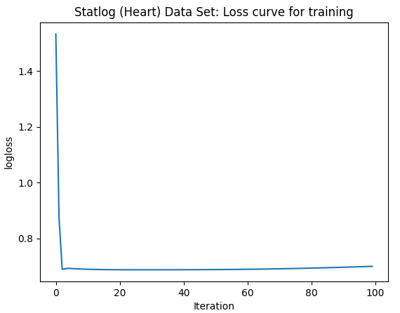
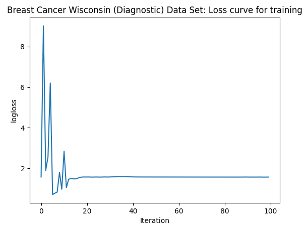

# Project 3: Neural Network
Build a neural network to model the prediction process programmatically.

# Dataset

### 1. Statlog (Heart) 
This is a heart disease database including 13 different features (age, sex, chest pain type, etc.). There are 270 samples in total, in which the training set contains 216 samples (80%) while the test set contains the remaining 54 (20%). The goal is for the neural network to predict if a patient has heart disease or not.

### 2. Breast Cancer Wisconsin (Diagnostic)
This is the Diagnostic Wisconsin Breast Cancer Database with 30 different features computed for each cell nucleus. They include attribute information about radius (mean of distances from center to points on the perimeter), texture (standard deviation of gray-scale values), perimeter, area, smoothness (local variation in radius lengths), etc. Similar to train test split (80/20) in Statlog (Heart), there are 569 samples in total, in which the training set contains 455 samples while the test set contains the remaining 114. The goal is to predict if a patient has breast cancer or not.

# Forward Propagation
Forward propagation is a series of computation that the neural network runs to make a prediction. First, compute the weighted sum between the input and the first layer's weights and then add the biases. Then, pass the result through a sigmoid activation function and use this output as an input for the weighted sum and activation in the next layer. Finally, as we reach the output node, we have a predicted output value that can be used to compute the loss between itself and the true value.

# Backward Propagation
Backward propagation is the process of updating a neural network's weights and biases to train and minimize the loss between a predicted output and a true value. Thus, in a given amount of iterations, the model will go back and forth between forward propagation and backward propagation to get the best weights and biases for their nodes. 

# Compilation
Use `pip install -r requirements.txt` to install the required packages used in this project.

Then run `python main.py`.

This project can be saved as a pickle file if needed.

# Results and future directions

Because of limitation of computational resources, I decided to train and test the model with two relatively small corpus.

Future directions would be to test it with bigger corpus (including expansion for regression and multi-class classification task). Also, it would be good to look into what number of hidden layers and nodes per layer are usually recommended. Furthermore, it would be ideal to also include 10-fold cross validation as well as batch sizes for the training set to help improve the performance of the model, especially in the case where we have a large dataset. 

# References

https://heartbeat.fritz.ai/building-a-neural-network-from-scratch-using-python-part-1-6d399df8d432

https://heartbeat.fritz.ai/building-a-neural-network-from-scratch-using-python-part-2-testing-the-network-c1f0c1c9cbb0

https://archive.ics.uci.edu/ml/datasets/Statlog+%28Heart%29

https://archive.ics.uci.edu/ml/datasets/Breast+Cancer+Wisconsin+%28Diagnostic%29

https://stackabuse.com/creating-a-neural-network-from-scratch-in-python/

https://www.youtube.com/watch?v=GJXKOrqZauk
