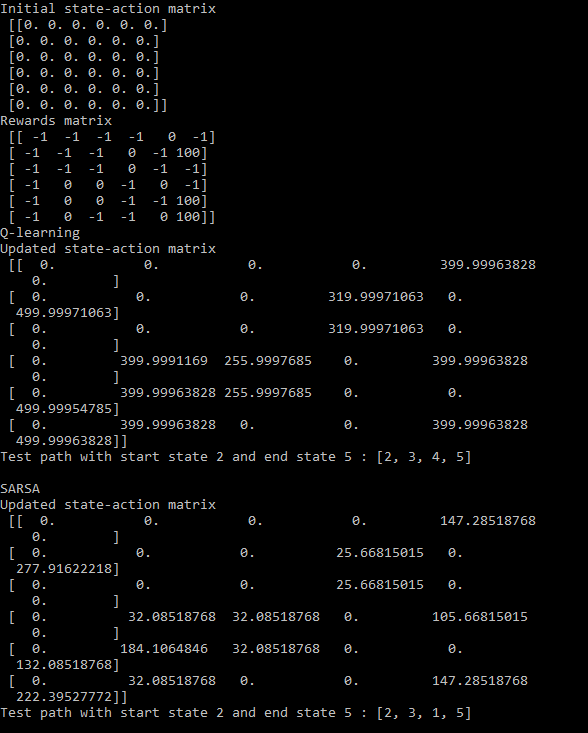

# Project 4: Reinforcement Learning

Reinforcement learning is a type of machine learning in which an agent learns to behave in an unknown environment by performing actions and seeing the following results. 
The agent’s objective is to learn to act in ways that maximizes expected long-term rewards. 
SARSA and Q-learning are two reinforcement learning methods that do not require model knowledge, only observed rewards from many experiment runs.
Both SARSA and Q-learning uses temporal difference learning concept, where the model updates the optimal policy as it goes toward the goal.

# Q-Learning
Q-leaning is an off-policy learning algorithm because the new action is taken as greedy, not using the current policy.
Q-learning can be said to be an 'exploration' algorithm.
Exploration means exploring and capturing more information about the environment.

# SARSA
SARSA is an on-policy learning algorithm because new action is chosen using the same greedy policy as the previous action.
SARSA can be said to be an 'exploitation' algorithm.
Exploitation involves using the already known information to heighten the rewards.

# Compilation
Use `pip install -r requirements.txt` to install the required packages used in this project. Then run `python main.py`.

# Approach & Results

I used the basic example of a building with 5 rooms numbered 0-4. 
Doors 1 and 4 connect directly to the exit.
A reward value is associated with each room (state). 
The graph below demonstrates the relationship between the rooms.
The goal for the agent is to exit the building (numbered 5) given any start location. 
The results from both Q-learning and SARSA are included below.

# References

https://blog.floydhub.com/an-introduction-to-q-learning-reinforcement-learning/

https://tcnguyen.github.io/reinforcement_learning/sarsa_vs_q_learning.html

https://heartbeat.fritz.ai/introduction-to-reinforcement-learning-a91beec7f830